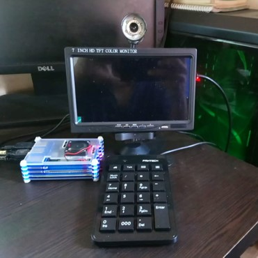

# E-ATM
Enhance Automated Teller Machine (ATM) Security by Introducing Facial Recognition

# 1.	Introduction
An automated teller machine (ATM) is an electronic telecommunications device that enables customers of financial institutions to perform financial transactions, such as cash withdrawals, deposits, funds transfers, or account information inquiries, at any time and without the need for direct interaction with the bank staff. The total number of automated teller machine (ATM) booths in Bangladesh reached 10,924 at the end of December 2019 with total cash transactions through ATMs stood at about Tk 147.05 billion in the year 2019. This ever-growing technology demands a lot of security to make sure that clients can perform their transection with adequate safety. Covering the ATM booth with Closed-Circuit Television Camera (CCTV) and security guard (human) are physical security measures along with other technology-based securities like firewalls, data encryptions, network security etc. are already implemented to ensure safe ATM service for the clients. However, scams like stolen cards, fake cards, card cloning, skimming, etc. have become very common recently and these could deceive existing security measures easily. 
With advances in Machine Learning and Computer Vision, distinguish a human face from a digital image or a video frame from a video source and characterize each human face with unique identification is possible. Therefore, this project aims to create a facial recognition-based ATM to make sure that every transaction is done with the consent of a related account holder.
# 2.	Objectives
In the above context, the main objectives of this research project are to add a new layer of security over the existing ATM system without any existing hardware changes such that transactions will not only depend on the correct PIN of a card but also the person performing the transaction.
# 3.	Rationale
This following three main research questions can be raised in this research proposal:
* How ATM will be distinguished original account holder from others?
* What if ATM could not identify the original account holder?
* What are the consequences if others try to access the ATM?

Upon completion of this research, all the financial institutions, providing ATM services, will be able to ensure a much safer environment for their clients. Also, the rate of ATM card fraud in Bangladesh will lessen.  
# 4.	Methodology
The human face is identified using the Histogram of Oriented Gradients (HOG) method. Affine transformation of the face is done using the dlib library. A Deep Convolutional Neural Network (Deep CNN) is trained to get unique measurements from the human face (128 different measurement from a single face), and Support Vector Machine (SVM) for face classification (identification).

## Tools to develop the project:
* Programming Language: Python 3
* Database: SQLite 3
* Code Editor: Pycharm 2020.2

## Python Dependencies:  
* opencv-python (3.4.6.27)
* numpy (1.19.1)
* cmake (3.18.2)
* dlib (19.18.0)
* face-recognition (1.3.0)
* twilio (6.45.3)
* tkinter (8.6)

## Hardware for Simulation:  
* Raspberry Pi 4
* USB Generic Webcam
* Numeric Pad (USB)
* 7” HD TFT Color Monitor
# 5.	Demo

